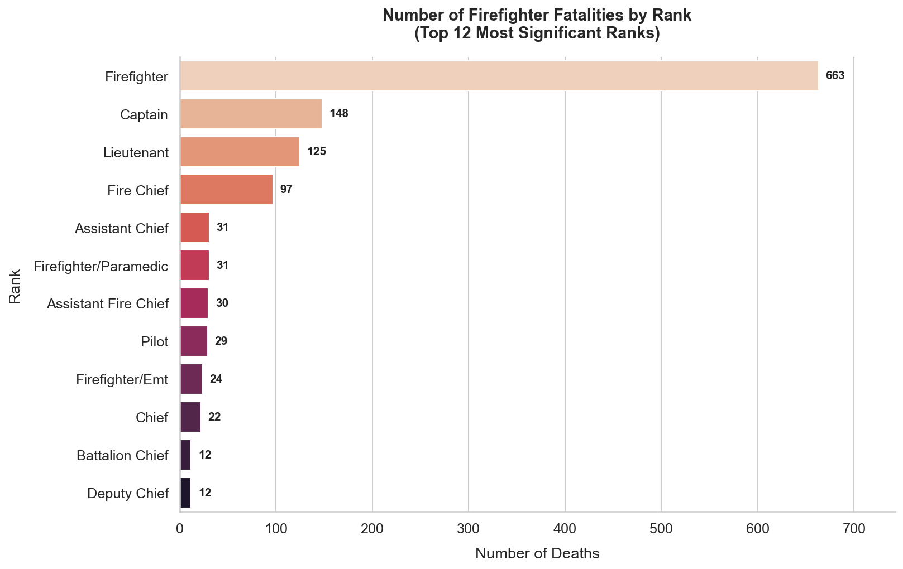
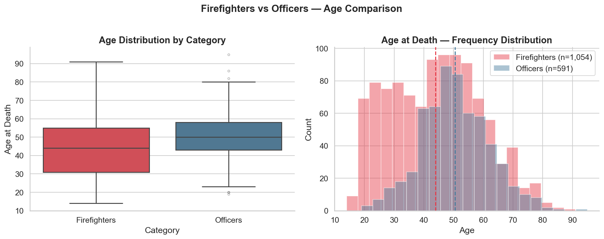
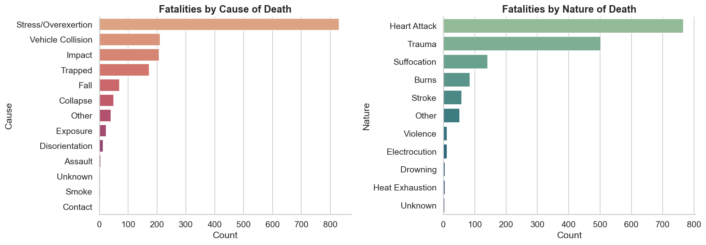

 🚒 Firefighter Mortality Analysis

Exploratory Data Analysis (EDA) of firefighter mortality patterns using Python.

 📊 Project Overview

This project explores patterns in firefighter mortality data to identify trends, causes, and risk factors.  
The analysis focuses on understanding how different variables may influence firefighter deaths.

 🧰 Technologies Used

- Python
- Pandas
- NumPy
- Matplotlib
- Seaborn
- Jupyter Notebook

 📂 Project Structure

project/
│
├── data/        # dataset
├── notebooks/   # analysis notebooks
├── images/      # generated charts
└── README.md

 📈 Analysis Performed

- Data cleaning
- Exploratory Data Analysis (EDA)
- Visualization of mortality patterns
- Identification of trends

 📷 Example Visualizations

Below are some key insights from the analysis:

 Mortality by Rank


 Age Distribution


 Cause of Death Nature


 🚀 How to Run the Project

1. Clone the repository

```
git clone https://github.com/PedroNunesBM/firefighter-mortality-analysis.git
```

2. Install dependencies

```
pip install -r requirements.txt
```

3. Run the notebook

```
jupyter notebook
```

## 📚 Future Improvements

- Apply machine learning models
- Predict mortality risk factors
- Build interactive dashboards

## 👨‍💻 Author

Pedro Nunes  
Aspiring Data Scientist
